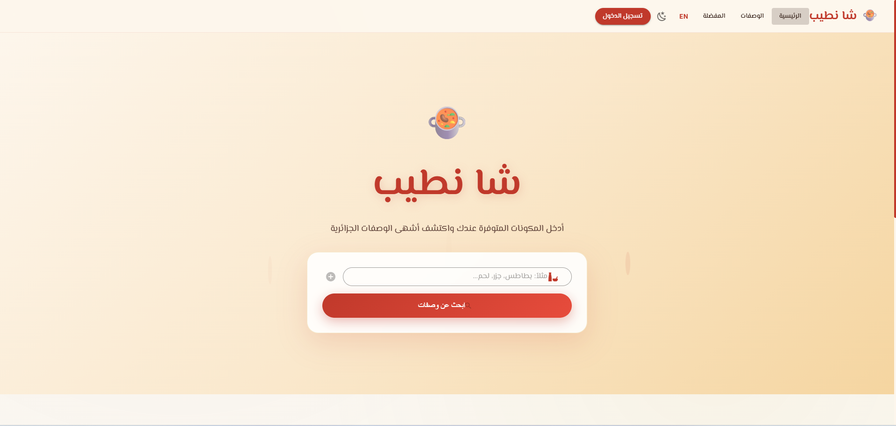
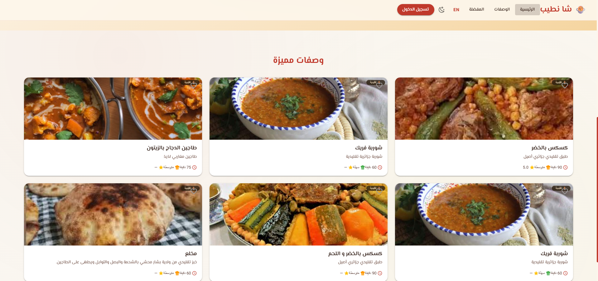
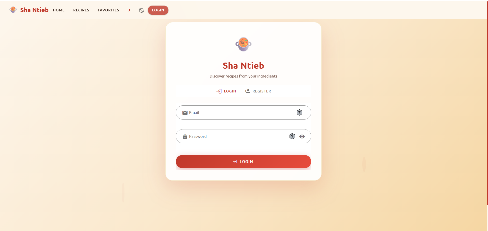
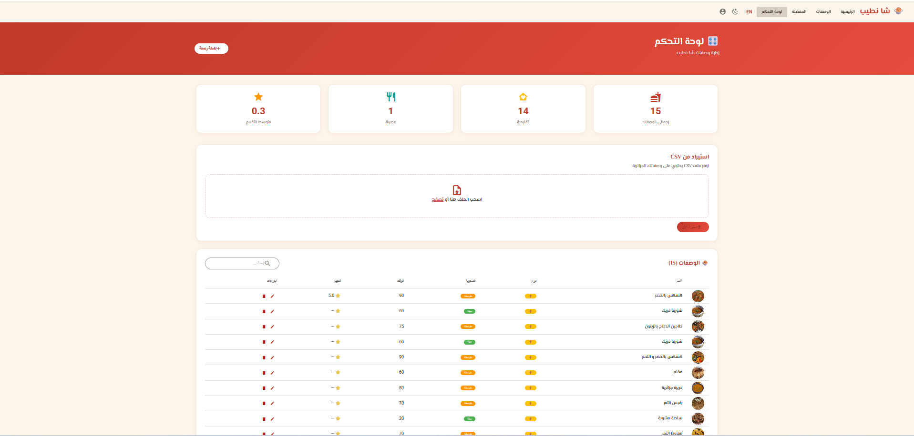

🥘 Sha Ntieb — What should I cook?
> An Algerian web application for recipe recommendations based on available ingredients.


---

## Screenshots

>Home — Search Components — Control Panel






---

## Features
    🏺 Traditional & Modern Algerian Recipes
    🌐 Bilingual Support — Arabic and English
    ❤️ Favorites List for registered users
    ⭐ Rating System for recipes
    🎛️ Admin Dashboard for recipe management
    📂 Bulk CSV Import for recipes
    🌙 Dark/Light Mode
    📱 Responsive Design optimized for mobile devices

---

## Tech Stack

| Layer | Technology |
|--------|---------|
| Frontend | Vue.js 2 + Vuetify + Vuex + Vue Router |
| Backend | Python + FastAPI |
| Database | MySQL |
| AI Engine | TF-IDF + Sentence Transformers |
| Auth | JWT Token |

---

## Requirements
| Tool | Version | Download Link |
|--------|---------|-------------|
| Python | 3.10+ | https://www.python.org/downloads/ |
| Node.js | 16+ | https://nodejs.org/ 
| MySQL | 8.0+ | https://dev.mysql.com/downloads/ |
| Git | Any Version | https://git-scm.com/ |
---
## Installation

### 1 Clone the project
```bash
git clone https://github.com/feredj/sha-ntieb
cd sha-ntieb
```
###  2 Database 
Import the sha_ntieb.sql file into your MySQL instance.


---

### 3 Backend Setup

```bash
cd backend
# Create the virtual environment
python -m venv .venv
# Activate the environment (Windows)
.venv\Scripts\activate
# Activate the environment (Linux/Mac)
source .venv/bin/activate
# Install the libraries
pip install -r requirements.txt
```

## Run Backend:
```bash
uvicorn app.main:app --reload --port 8000
```
 Backend works on: **http://localhost:8000**
 Swagger Docs: **http://localhost:8000/docs**
---
### 4️ Frontend Setup
```bash
cd frontend

# Install libraries
npm install

# Run project
npm run serve
```
Frontend runs on: **http://localhost:8080**
---

## 5 Import Recipes
Use the recipes.csv file included in the project:

1. Login with an Admin account.
2. Navigate to the Admin Dashboard at /admin.
3. Upload the recipes.csv file.

## CSV File Format:
name_ar,name_en,description_ar,description_en,preparation_ar,preparation_en,is_traditional,ingredients_ar,ingredients_en,quantities,units,categories,prep_time,difficulty,image_url
كسكس بالخضر,Couscous with Vegetables,...,true,"جزر,بطاطس","carrots,potatoes","3,2","حبات,حبات","Vegetables,Vegetables",90,medium,https://...

## Running the Project
Open two terminals simultaneously:

```bash
# Terminal 1 — Backend
cd backend
.venv\Scripts\activate
uvicorn app.main:app --reload --port 8000

# Terminal 2 — Frontend  
cd frontend
npm run serve
```

## Default Credentials
| Account | Email | Password |
|--------|--------|-------------|
| Admin | admin@gmail.dz | admin123 |